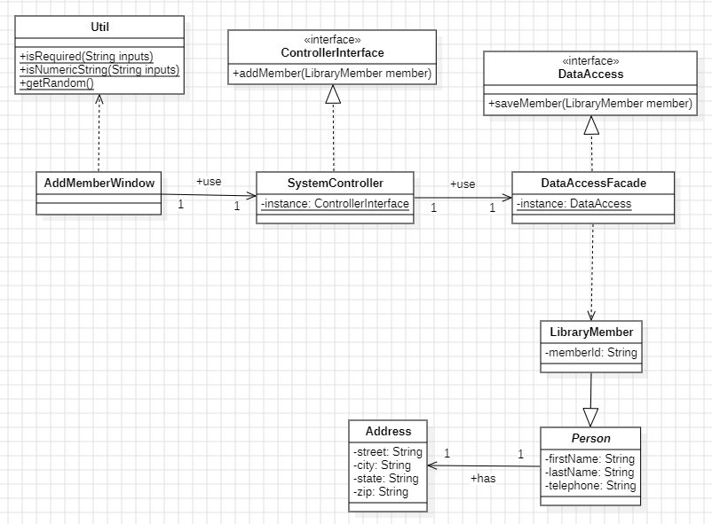
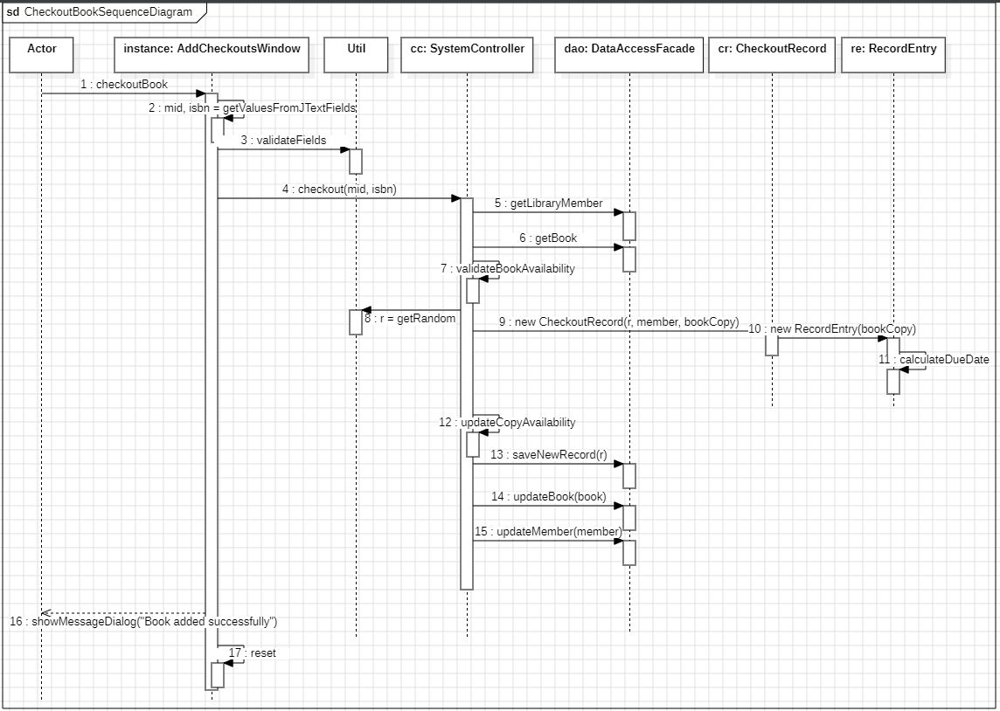
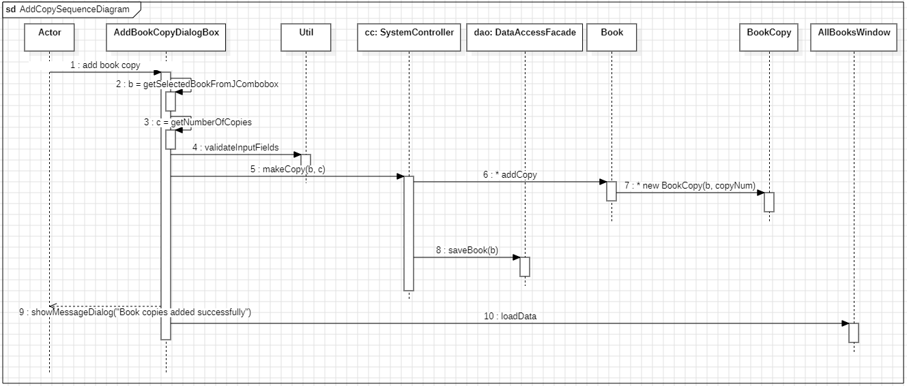
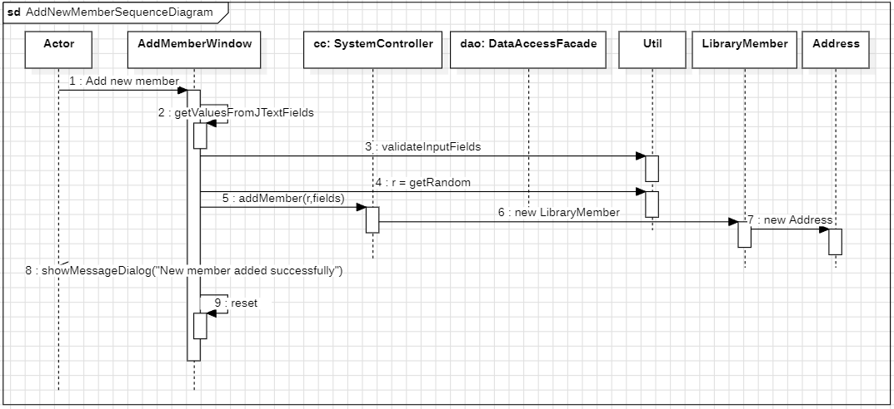

# Library Management System
- Group 1
## Members
- Aung Thu Moe (618691)
- Kanchan Kumar Shaw (618646)
- Zaw Ye Naing (618680)

## How to run the codes
- Download the project from github repository.
- Import the project into your Intellij.
- Make sure `AUTHORS, BOOKS, MEMBERS, RECORDS, USERS` files are exist in the `src/dataaccess/storage/` folder (optional).
- Run `src/dataaccess/TestData.java` file to initialize the test data.
- Execute `src/ui/Main.java` to run the project.

## User data

| Username | Password     | Auth        |     
|----------|--------------|-------------|
| `101`    | `password`   | `LIBRARIAN` |
| `102`    | `password`   | `ADMIN`     |
| `103`    | `password`   | `BOTH`      |

## Changes after presentation.
- We fixed the issue regarding book copies number not saved during book creation.
- We added more interactive messages on saving models such as saving new library member, new book, new book copy and new checkout record.

## Question C. Class diagrams for Add New Library Member

## Question D
### 1. Checkout Book Use case

### 2. Add a copy of an existing book

### 3. Add a new member
